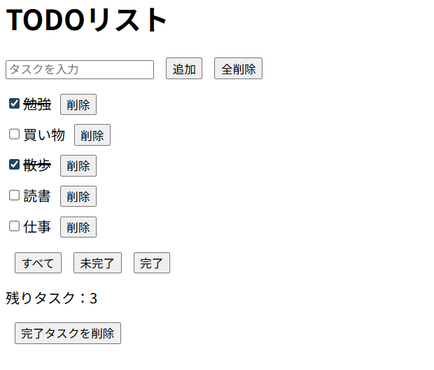

# TODOリスト

---

## Demo

[TODOリスト アプリ](https://yaki-onigiri.github.io/02-todo-list)

## Source Code

[GitHub Repository](https://github.com/yaki-onigiri/02-todo-list)

---

## アプリ概要

タスク管理の基本的な機能を実装したTODOアプリです。
JavaScriptのDOM操作、イベント処理、localStorageによるデータ保存の理解を目的として作成しました。

---

## アプリ画面

---

## Features（主な機能）

・タスク追加
    入力欄にタスクを入力し、ボタンまたはEnterキーで追加できます。

・タスク個別削除
    指定したタスクのみを個別で削除できます。

・完了 / 未完了チェック
    チェックボックスでタスクの状態を管理できます。

・残りタスク数の表示
    未完了タスクの数を自動で表示します。

・全削除
    全部のタスクを削除することができます。

・完了タスク一括削除
    チェックを付けたタスク（完了タスク）のみを指定して、ボタンで一括削除できます。

・localStorage保存
    タスクが残っている状態で一度アプリを閉じても、もう一度アプリを開いたら、閉じる前のタスクがそのまま残っている状態にすることができます。

・タスクのフィルター機能

    - すべて
    - 未完了
    - 完了

        条件に応じてタスク表示を切り替えることができます。

・タスク編集機能（ダブルクリック）
    既存タスクをダブルクリックすることで、タスク名を編集することができます。

・フィルター状態の保存（localStorage）
    最後に選択したフィルター状態を保持します。

・ドラッグ＆ドロップでタスク並び替え
    タスクに左クリック長押しで移動させ、左クリックを離すと任意の場所にタスクを移動させることができます。

・スマホでも対応
    CSSに「@ media」を追加して、スマホ画面でも対応できるようにしました。

---

## 使用技術

- HTML
- CSS
- JavaScript
- localStorage
- GitHub Pages

---

## How to Run

1．このリポジトリをダウンロードまたはクローンします。
git clone https://github.com/yaki-onigiri/02-todo-list.git

2．フォルダを開きます。
cd 02-todo-list

3．index.html をブラウザで開きます。

## フォルダ構成

.
├ index.html
├ css
│ └ style.css
├ js
│ └ script.js
├ README.md
└ docs
  ├ learning-note.md
  ├ dev-log.md
  └ screenshots
    └ todo-app.png

---

## 学習ポイント

このアプリでは以下の内容を重点的に学習しました。

- DOM操作（ createElement / appendChild ）
- イベント処理（ click / keydown / change ）
- localStorageによるデータ保存
- JSON.stringify / JSON.parse
- “配列”と“オブジェクト”を使ったデータ管理
- タスクフィルターの実装
- dragstart / dragover / drop イベント

---

## 今後の改善予定

・UIデザインの改善
・アニメーション追加
・ダークモード

---
